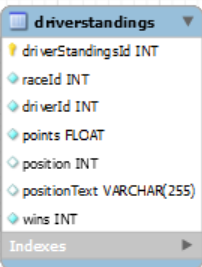
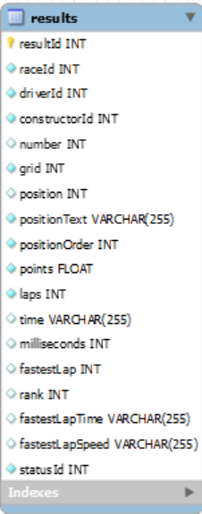
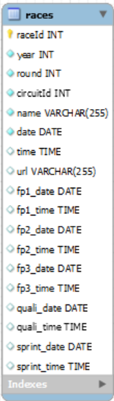

# Ergast F1

## DESCRIPCIÓN DE LA API
Servicio web experimental que proporciona un registro histórico de datos de carreras de motor con fines no comerciales, muestra todos los resultados de todas las temporadas de la F1 desde el inicio de los campeonatos del mundo en 1950.

## ESTRUCTURA DE LA BBDD
Las estructura de esta base de datos se compone de diversas tablas de las cuales nosotros solo utilizamos estas tres:

-

-

## MANUAL TÉCNICO PARA DESARROLLADORES
Obtenemos la información de la BBDD sobre las clasificaciones mediante consultas, utilizando JDBC ejecutando una query que devuelve un resultSet que almacena datos.

Las consultas obtienen la clasificación de los pilotos especificando la temporada (año) de esta manera:
where year = "+anos.getValue()+"

Nuestro programa se basa en un TableView que muestra los datos de la clasificación en sus respectivas TableColumn según la temporada (año) que lo seleccionaremos en un ComboBox, a continuación presionaremos el Button 'Buscar' que hará reflejar los datos en el TableView.
Luego por debajo del TableView habrá un TextField donde podremos poner el nombre al archivo para posteriormente exportarlo con el Button ubicado ala derecha a formato JSON.

## MANUAL DE USUARIO CON JUEGO DE PRUEBAS

Nuestro programa se basa en una tabla que muestra los datos de la clasificación en sus respectivas columnas según la temporada (año) que lo seleccionaremos en un desplegable, a continuación presionaremos el botón 'Buscar' que hará reflejar los datos en la tabla.
Luego por debajo de la tabla habrá un hueco para escribir donde podremos poner el nombre al archivo para posteriormente exportarlo con el botón ubicado ala derecha, a formato JSON.

## REPARTO DE TAREAS
Ismael: búsqueda de información, creación del diseño, readme.md y escritura de código fuente comentado.
Gael: escritura del código fuente, creación del diseño y explicaciones a su compañero.

## PROPUESTAS DE MEJORA
-Buscar por rondas aparte de buscar por años.

-Diseño más atractivo

-Poco aprovechamiento de la API
## CONCLUSIONES Y OPINIÓN
Trabajo de consulta y exportación de los datos de una BBDD, por el cual hemos aprendido a manejar JDBC, en nuestra opinión hemos realizado un trabajo simple pero que cumple requisitos, nos ha servido sobre todo para aprender y repasar para el examen, ya que le hemos dedicado tiempo, pero tampoco excesivo, la mayor parte del trabajo lo hemos realizado en clase invirtiendo poco tiempo en casa, teniendo en cuenta nuestro trabajo pensamos que nuestra nota debería rondar sobre un 6.